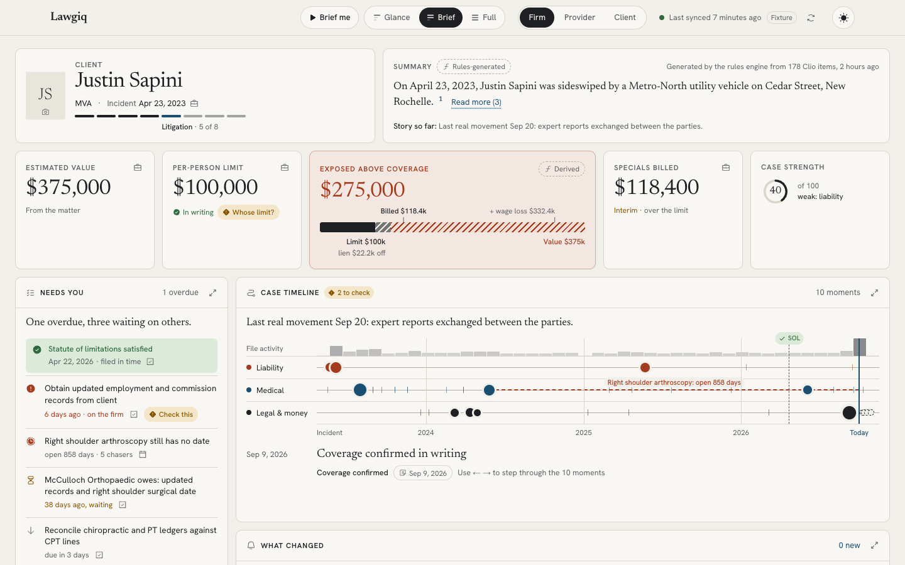

# Lawgiq

Swans x Law Di Gras 2026 Applied AI Hackathon (Won 3rd Place)

An AI case dashboard for a personal-injury firm. It digests one Clio Manage matter (Sapini) for three audiences: the firm (what matters most, what is due), the client's treating medical providers (only what is safe to share) and the client.

Clio is read only: every script issues GET requests only. Nothing about the case is in this repo. All data comes from the live Clio account through the Python pipeline and is stored locally under `data/` (gitignored).



## Pipeline

```
Clio (GET) ──► scripts/export_matter.py ──► data/clio/matter.json     matter, contacts, notes, emails, tasks, calendar, expenses, documents
          └──► ocr_pipeline.py          ──► data/raw/{id}.pdf          the source PDFs (embedded in the app)
                                        ──► data/ocr/{id}.json         per-page text, page numbers kept
               scripts/triage.py        ──► data/triage/*.json         Jev scores for every entry
               scripts/link_tasks.py    ──► data/links/task_{id}.json  records related to each task, who it waits on
                                                 └──► Next.js app (lib/clio/pipeline.ts)
```

1. **`scripts/export_matter.py`**: writes the matter's raw Clio records to `data/clio/matter.json`. The dashboard's Sync button re-runs it.
2. **`ocr_pipeline.py`**: downloads every document on the matter to `data/raw/`, reads each page's text layer with PyMuPDF, and OCRs pages with under 50 characters at 300 DPI with Tesseract. Writes one JSON per document: `source_type, source_id, name, matter_id, created_at, pages[{page, text, method, char_count}]`. Skips finished documents unless `--force`; `--limit N` / `--doc-id` run a subset.
3. **`scripts/triage.py`**: sends every note, communication, task, calendar entry and document (with its OCR text) to Jev and asks four constrained questions: category (8 choices), impact (5-level ladder), urgency (4-level ladder), and whether it is shareable with a treating provider. For documents Jev also picks the document's own date from date spans found in the text. Importance = 0.75 × impact + 0.25 × urgency; share at ≥ 0.90, review at ≥ 0.50. Results are cached; `--force` re-scores.
4. **`scripts/link_tasks.py`**: Clio has no links between tasks and other records, so they are inferred. Code proposes candidates (calendar entries, notes, communications, other tasks, expenses, individual document pages) scored on shared contacts, distinctive words and nearby dates; Jev confirms each one and names the relation (scheduled as, produces, verifies, follow-up, context). Jev only chooses among candidates code found, so it cannot invent a link. The same call asks whether the task is waiting on someone outside the firm, and who. Cached; `--force` re-asks, `--task-id` runs one task.

Steps 3 and 4 make no Clio calls; they read `data/` only. The app normalises `data/clio/matter.json`, attaches Jev scores to each timeline event (they add to the rules-based significance score in `lib/derive/rank.ts`), builds the task board from the links, and shows each document's PDF and OCR text in the source drawer.

## Run

Requires Python 3, Node.js and [Tesseract](https://github.com/tesseract-ocr/tesseract) (`brew install tesseract`; on Windows install it and set `TESSERACT_CMD` if it is not on `PATH`).

```bash
python3 -m venv .venv && .venv/bin/pip install -r requirements.txt
cp .env.example .env                        # fill in CLIO_TOKEN, MATTER_ID, TYPESAFE_API_KEY
.venv/bin/python scripts/export_matter.py   # Clio records -> data/clio
.venv/bin/python ocr_pipeline.py            # Clio documents -> data/raw, data/ocr
.venv/bin/python scripts/triage.py          # Jev triage -> data/triage
.venv/bin/python scripts/link_tasks.py      # Jev task links -> data/links
npm install
npm run dev                                 # open http://localhost:3000
npm test                                    # derive, headline and task-board tests, run against data/
```

On Windows use `.venv\Scripts\python` in place of `.venv/bin/python`. `python scripts/jev_test.py` is an optional one-call Jev smoke test.

## The app

A visual digest of the matter at `/` (the Front Page), with a Firm, Medical provider and Client view cut by a role-scoped access layer on the server.

- **Firm** (`/`): the case story, value against coverage, deadlines and statute of limitations, treatment timeline, and a task board (Overdue, Waiting on others, Upcoming, Done). Opening a task shows every record related to it, grouped by relation. Cards expand in place on the board.
- **Medical provider** (`/?role=provider&provider=<id>`): is the case alive, is there coverage, is the patient showing up, what does the firm need. Only allowlisted fields, plus whatever the attorney toggles on.
- **Client** (`/?role=client`): where the case is, what happens next, the next appointment, and the take-home picture in plain English.

Every number and date links to its source. The source drawer shows the Clio record, or for a document the PDF itself opened at the cited page with that page's extracted text below it. A "Brief me" walkthrough and a light/dark toggle are in the masthead.

- `/p/<token>` is the open-tracked link a provider receives when the attorney shares.
- `/api/view?role=provider&provider=<id>` returns the exact payload a provider's browser gets. Use it to check the access boundary.
- `/api/documents/<id>` serves a downloaded PDF, scoped to what the requesting view cites.

See [PRODUCT.md](PRODUCT.md) for who it is for and [DECISIONS.md](DECISIONS.md) for the design record. Screenshots are in [docs/screens](docs/screens) (`node scripts/capture.mjs` regenerates them; `node scripts/smoke.mjs` drives real input on every role view).

Optional settings in `.env` (Next.js reads it too):

| Variable | Purpose |
| --- | --- |
| `CLIO_APP_BASE` | Base for deep links into the Clio web app (default `https://app.clio.com`). |
| `ANTHROPIC_API_KEY` | Enables the cached AI digest (Claude Opus 5.5). Without it the rules engine writes the summary. |
| `DATASET_TODAY` | Pin "today" for demos and tests (e.g. `2026-10-02`). |
| `PIPELINE_DATA_DIR` | Read pipeline output from somewhere other than `data/`. |
| `PIPELINE_PYTHON` | Python used by the Sync button (default `.venv/bin/python`, else `python3`). |
| `LAWGIQ_DB_PATH` | SQLite file for app state (default `data/lawgiq.db`). |

## Layout

```
clio_client.py, ocr_*.py, scripts/*.py   the data pipeline (GET-only Clio, OCR, Jev triage, task links)
app/           Next.js routes: the Front Page, /p/<token> share links, /api (view, documents, sync, shares, settings)
lib/clio/      reads data/ (pipeline.ts) and normalises raw Clio records (normalise.ts)
lib/derive/    KPIs, task buckets, task board, SOL, deadlines, timeline merge + ranking, treatment gaps,
               specials, liability, scorecard, conflicts, rules digest
lib/access/    role-scoped selectors: firm, provider (allowlisted + attorney toggles), client
lib/ai/        optional Claude digest, cached per data hash
lib/db/        SQLite: snapshots, digests, last-opened, provider visibility, sharing log, photos
lib/server/    the one entry point pages call (load, derive, select by role) and document serving
components/case/        trust layer (source chips, drawer, embedded PDF viewer), sync, role switcher, shared viz
components/front-page/  the UI; it only consumes selector output
tests/                 derive, headline and task-board tests
ui/                    legacy Python preview dashboard (python ui/dashboard.py, http://127.0.0.1:8765)
```
